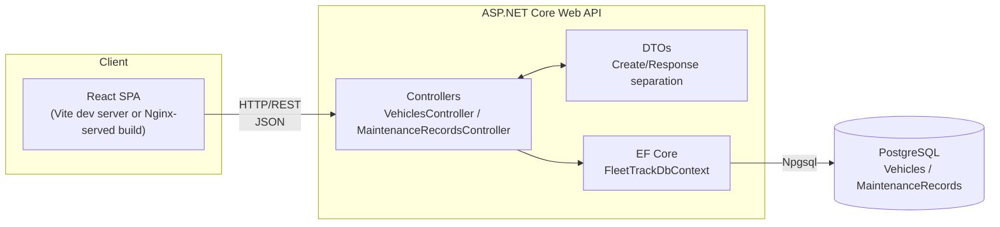
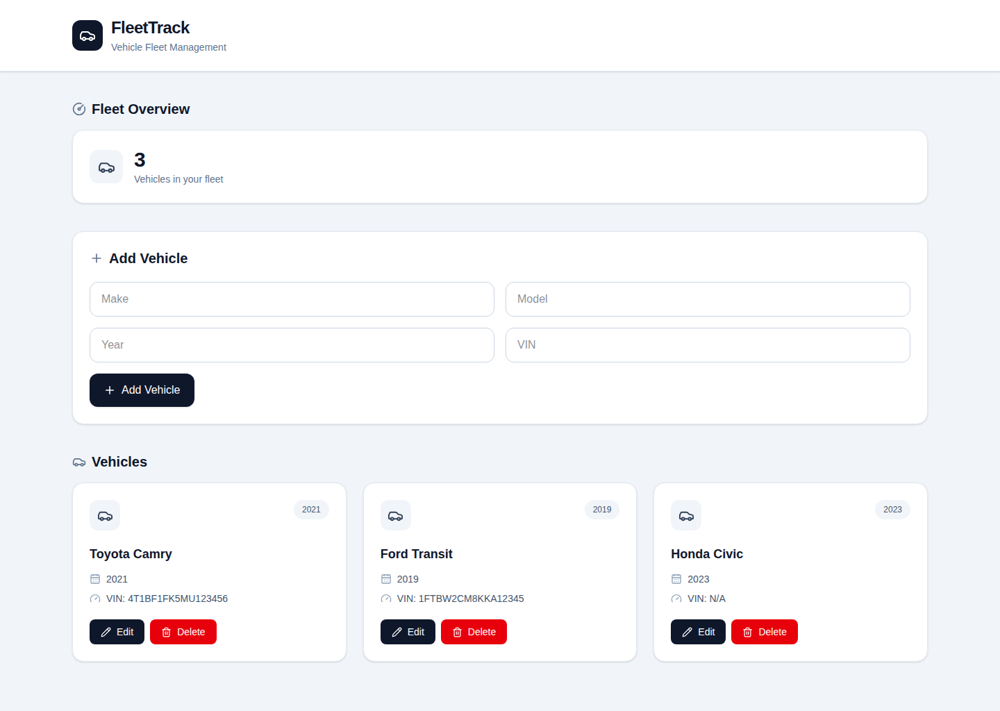
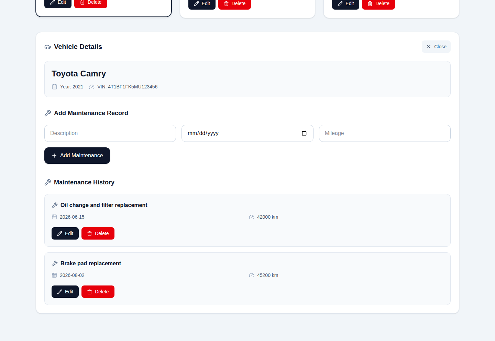

# FleetTrack

A full-stack vehicle fleet management application track vehicles and their maintenance history through a REST API backed by PostgreSQL, with both a fully Dockerized workflow and a local development workflow.


---

## 📋 Overview

FleetTrack lets a fleet operator manage vehicles and log maintenance history against them through a clean React dashboard, backed by a RESTful ASP.NET Core API and a PostgreSQL database. It currently supports:

- Full CRUD on vehicles (make, model, year, VIN)
- Full CRUD on maintenance records, scoped per vehicle (description, date, mileage)
- A live fleet overview and per-vehicle maintenance history in the UI
- Automatic EF Core database migrations on API startup
- Two complete, independent ways to run the stack: Docker Compose or local dev

## 🏗️ Architecture

FleetTrack uses a three-tier architecture consisting of a React frontend, an ASP.NET Core REST API, and a PostgreSQL persistence layer accessed through Entity Framework Core.



**Request flow:** the React app sends HTTP requests to the ASP.NET Core API using `fetch()` (for example, `GET /api/vehicles`). ASP.NET Core model-binds incoming JSON request bodies to DTOs, and the controllers use those DTOs to interact with the EF Core data layer. EF Core translates database operations into SQL through the Npgsql provider, which executes them against PostgreSQL. The resulting data is mapped to response DTOs and then back to JSON for the React application.

### API design

- **Resource-oriented REST controllers** - `VehiclesController` and `MaintenanceRecordsController`, each exposing standard `GET` / `GET {id}` / `POST` / `PUT {id}` / `DELETE {id}`, plus a `GET /api/MaintenanceRecords/vehicle/{vehicleId}` lookup for scoping maintenance history to a single vehicle.
- **DTO pattern, not raw EF models** - every endpoint maps to/from `VehicleCreateDto` / `VehicleResponseDto` and `MaintenanceCreateDto` / `MaintenanceResponseDto` rather than exposing `Vehicle`/`MaintenanceRecord` directly. This keeps the wire contract stable and separate from the database schema, and lets validation attributes (`[Required]`, `[Range(1900, 2100)]` on `Year`, `[Range(0, 2000000)]` on `Mileage`) live on the input side only.
- **Migrations run automatically on boot** - `Program.cs` resolves a scoped `DbContext` and calls `db.Database.Migrate()` before the app starts accepting requests, so a fresh container/database is brought up to date with no manual migration step.
- **CORS is explicitly scoped** - For the time being, the API only allows the two frontend origins it actually expects (`http://localhost:5173` for Vite dev (local), `http://localhost:3000` for the Dockerized/Nginx frontend), configured as a named policy in `Program.cs`.

### Docker network vs. local network

In the Dockerized setup, the frontend container **does not** reach the API through Docker's internal network - the React application running in the user's browser calls the API at `http://localhost:5002` directly. The API service's port is published to the host (`5002:8080` in `docker-compose.yml`) so the browser can reach the API outside the Docker network.

This is why CORS matters in the current setup: the browser is making the cross-origin request from `http://localhost:3000` to `http://localhost:5002`. If the frontend were instead routed through an Nginx reverse proxy to the API, the browser could communicate through the same origin and CORS would no longer be required for that frontend-to-API path.

## 📁 Project Structure

```text
FleetTrack/
├── backend/
│   └── FleetTrack.Api/
│       ├── Controllers/          # VehiclesController, MaintenanceRecordsController
│       ├── Data/                 # FleetTrackDbContext
│       ├── Dtos/                 # Create/Response DTOs per resource
│       ├── Models/               # Vehicle, MaintenanceRecord (EF entities)
│       ├── Migrations/           # EF Core migration history
│       ├── Program.cs            # App startup, DI, CORS policy, auto-migrate
│       ├── appsettings.json
│       ├── appsettings.Development.json
│       └── Dockerfile
├── frontend/
│   ├── src/
│   │   ├── App.jsx               # Entire dashboard UI (fleet overview, CRUD forms, vehicle/maintenance views)
│   │   ├── App.css / index.css
│   │   └── assets/
│   ├── package.json
│   ├── vite.config.js             # React + Tailwind v4 Vite plugins
│   └── Dockerfile                 # Multi-stage: Node build → Nginx serve
├── docker-compose.yml             # database + api + frontend services
├── .env.example
└── README.md
```

## 🛠️ Tech Stack

| Layer | Technology |
|---|---|
| Frontend | React 19, Vite 8, Tailwind CSS 4, lucide-react icons |
| Backend | ASP.NET Core 8 Web API, C# |
| ORM | Entity Framework Core 8 (`Npgsql.EntityFrameworkCore.PostgreSQL`) |
| Database | PostgreSQL 16 |
| API tooling | Swagger / Swashbuckle (dev environment) |
| Containerization | Docker, Docker Compose (multi-stage builds, Nginx-served frontend) |

## 🚀 Getting Started

There are 2 fully supported ways to run FleetTrack - pick whichever fits what you're doing.

| | 🐳 Docker Compose | 💻 Local Development |
|---|---|---|
| Frontend | React + Nginx | React + Vite dev server |
| Frontend URL | `localhost:3000` | `localhost:5173` |
| Backend | ASP.NET Core container | `dotnet run` |
| Database | PostgreSQL container | Local PostgreSQL instance |
| Setup needed | Docker Desktop only | .NET 8 SDK + Node.js + PostgreSQL |
| Migrations | Automatic on container start | Automatic on `dotnet run` |
| Best for | Quick setup, demoing, reproducing the whole stack | Active development, debugging |

---

### 🐳 Option 1 - Docker Compose

**Prerequisites:** [Docker Desktop](https://www.docker.com/products/docker-desktop/), running.

1. Copy the environment template and adjust if you'd like.

   **Windows PowerShell:**
   ```powershell
   Copy-Item .env.example .env
   ```

   **macOS/Linux:**
   ```bash
   cp .env.example .env
   ```

2. From the repo root, build and start everything:

   ```bash
   docker compose up --build
   ```

   Thats it!. This builds the API and frontend images, starts a PostgreSQL container with a named volume (`postgres_data`), waits for the database healthcheck to pass, then starts the API (which applies EF Core migrations automatically) and the Nginx-served frontend.

3. Open **http://localhost:3000** and view the SPA.

**Subsequent runs:** just `docker compose up` (no `--build`) unless you have changed code that needs rebuilding.

**Stopping / cleanup:**

```bash
docker compose stop        # stop containers, keep them
docker compose down        # stop + remove containers, keep the DB volume
docker compose down -v     # stop + remove containers AND the DB volume (deletes data)
```

---

### 💻 Option 2 - Local Development (more steps - only recommended if using for development)

**Prerequisites:** .NET 8 SDK, Node.js + npm, PostgreSQL 16+.

The local development configuration in `appsettings.Development.json` expects PostgreSQL to be reachable at **`localhost:5432`**.

**Already have PostgreSQL installed and configured with the `fleettrack` user and database? Skip Steps 1-4 and go directly to Step 5.**

1. **Install PostgreSQL**

   Install PostgreSQL 16 or newer and make sure the PostgreSQL command-line tools (`psql`) are available in your PATH.

2. **Start PostgreSQL**

   Ensure the PostgreSQL service is running and listening on port `5432`.

   **Windows PowerShell:**

   ```powershell
   Get-Service *postgres*
   ```

   If the PostgreSQL service is installed but stopped, start it with:

   ```powershell
   Start-Service postgresql-x64-17
   ```

   If you installed a different PostgreSQL major version, replace `postgresql-x64-17` with the service name for your installation.

3. **Create the FleetTrack PostgreSQL user**

   Run the following command and enter the password you chose when installing PostgreSQL when prompted:

   ```powershell
   psql -U postgres -p 5432 -c "CREATE USER fleettrack WITH PASSWORD 'fleettrack123';"
   ```

   This creates the PostgreSQL user `fleettrack` with the credentials expected by FleetTrack's local development configuration.

4. **Create the FleetTrack database**

   Run:

   ```powershell
   psql -U postgres -p 5432 -c "CREATE DATABASE fleettrack OWNER fleettrack;"
   ```

   This creates the `fleettrack` database and makes `fleettrack` its owner.

5. **Start the API** (terminal 1):

   ```powershell
   cd backend/FleetTrack.Api
   dotnet run
   ```

   The terminal will print the URL the API is listening on. EF Core migrations are applied automatically on startup.

6. **Start the frontend** (terminal 2):

   ```powershell
   cd frontend
   npm install
   npm run dev
   ```

   Open the URL Vite prints - typically **http://localhost:5173**.

---

## 🔌 API Reference

| Method | Endpoint | Description |
|---|---|---|
| `GET` | `/api/vehicles` | List all vehicles |
| `GET` | `/api/vehicles/{id}` | Get a single vehicle |
| `POST` | `/api/vehicles` | Create a vehicle |
| `PUT` | `/api/vehicles/{id}` | Update a vehicle |
| `DELETE` | `/api/vehicles/{id}` | Delete a vehicle |
| `GET` | `/api/MaintenanceRecords` | List all maintenance records |
| `GET` | `/api/MaintenanceRecords/{id}` | Get a single maintenance record |
| `GET` | `/api/MaintenanceRecords/vehicle/{vehicleId}` | List maintenance records for one vehicle |
| `POST` | `/api/MaintenanceRecords` | Create a maintenance record |
| `PUT` | `/api/MaintenanceRecords/{id}` | Update a maintenance record |
| `DELETE` | `/api/MaintenanceRecords/{id}` | Delete a maintenance record |

## 🖥️ Dashboard

The React dashboard currently covers fleet overview stats, an "Add Vehicle" form, a vehicle grid with inline edit/delete, and a per-vehicle detail view for adding and managing maintenance records.

**Fleet overview:**



**Vehicle detail - maintenance history:**



## 🧯 Troubleshooting (quick reference guide)

**Port already in use** - check whether another instance of FleetTrack (or another app) is already bound to that port. Use `docker compose stop` or `docker compose down` if it's a leftover container.

**API returns database errors** - confirm that PostgreSQL is actually running and reachable at the connection string the API is using (container network for Docker, `localhost:5432` for local dev).

**Browser reports a CORS error** - confirm you are hitting the frontend on the origin that the API's CORS policy expects (`:3000` for Docker, `:5173` for local), and that the API itself is up.

**Database tables are missing** - restart the API; it checks for and applies pending EF Core migrations on every startup. If you ran `docker compose down -v`, the next `docker compose up` recreates the database from scratch and reapplies migrations.

## 🔮 Future Improvements

- Vehicle/maintenance search and filtering
- Fleet analytics and reporting (e.g. upcoming maintenance, cost tracking)
- Authentication and authorization
- Route the Dockerized frontend's API calls through an Nginx reverse proxy instead of a hardcoded `localhost:5002`, so the frontend doesn't depend on the API's host port being exposed
- Automated unit and integration tests
- A real production deployment target (currently Docker Compose is oriented at local reproducibility, not production hosting)

## 📄 License

This project is currently intended as a personal software engineering project and portfolio piece.

